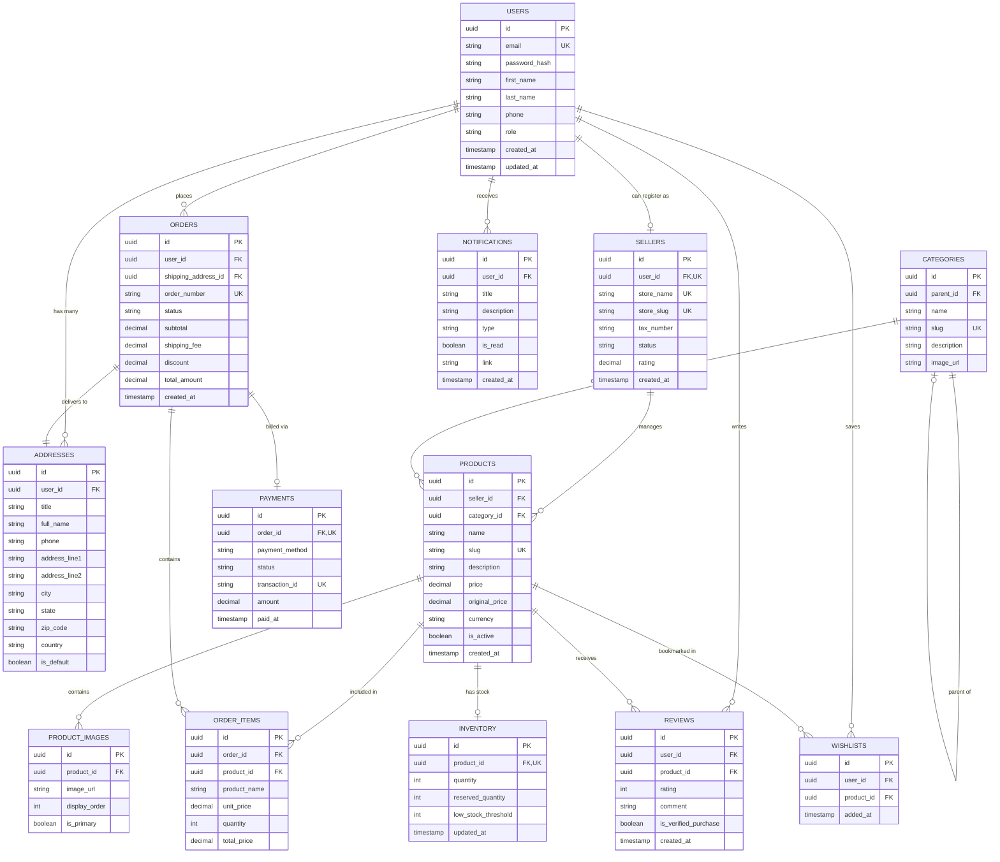

# Entity Relationship Diagram (ERD)

Below is the complete database architecture diagram rendered using Mermaid GFM standard. It illustrates the 13 core domain entities and their relational cardinality.

